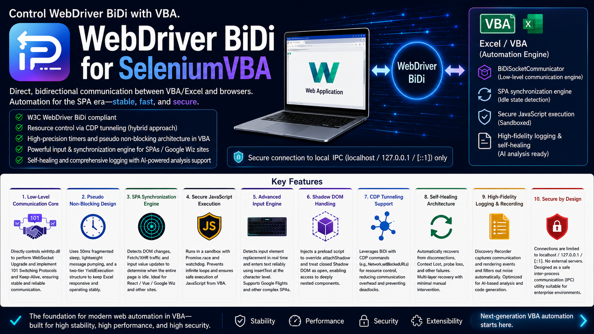

# WebDriver BiDi for SeleniumVBA

# WebDriver BiDi Extension for SeleniumVBA

This project is a WebDriver BiDi extension for **[SeleniumVBA](https://github.com/GCuser99/SeleniumVBA)** by @GCuser99.

It was developed based on **"ZeroInstall BrowserDriver for VBA"** by @kabkabkab, replacing the original CDP-based connection with WebDriver BiDi over WebSocket communication.

This project is not intended to replace SeleniumVBA, Playwright, Puppeteer, or Selenium itself.  
Instead, it focuses on extending SeleniumVBA with WebDriver BiDi capabilities, especially for modern third-party SPA sites where no explicit completion signal is available.

Modern SPAs such as React, Vue.js, and enterprise web applications often update the DOM asynchronously after network responses have completed. This makes traditional VBA automation fragile, because "request completed" does not always mean "page is ready."

To address this, the tool observes network activity, Fetch/XHR activity, DOM mutations, and quiet windows to infer when the page has become stable enough for the next automation step.

Since this project assumes concurrent use of classic SeleniumVBA methods and BiDi-based observation, the BiDi API surface is intentionally kept minimal.

## Discovery Log

The Discovery Log is designed for third-party SPA sites where the automation code cannot access an internal "ready" or "completed" flag.

It records network responses, DOM mutation bursts, suppressed background noise, and stability margins such as `slackMs`.

This makes it easier to determine which requests should be tracked, which requests should be ignored, which resources may be safely blocked, and whether the current wait thresholds are appropriate for the target site.

In other words, the Discovery Log is not just an execution log.  
It is a diagnostic tool for discovering what should be waited for when automating unknown third-party SPAs.

## Validation Benchmark

For validation, this project uses a challenging benchmark: entering text into the ServiceNow login form.

ServiceNow is frequently regarded as one of the more difficult Single Page Applications to automate due to its complex SPA behavior, Shadow DOM usage, and asynchronous UI updates.

The validation code is contained in the `Main07` procedure.
---
## [Supported OS]
* **Windows11**
## [Supported Browsers]
* **Edge / Chrome**
* *Firefox is not supported due to functional limitations.*

---

## 📂 Procedure Overview (Sample Module: `A_01_BiDi_Sample`)

### 1. Main01: Enhanced Select Box & Extension Injection & Recording
This procedure focuses on handling elements that trigger complex JavaScript state changes.
* **Dynamic Extension Injection:** Utilizes the WebDriver BiDi `ExecuteWebExtensionInstall` command to load extensions directly into the browser session from a local path. This enables the runtime "bypass injection" of extensions without cluttering the system registry. *(Note: Please ensure that the Google Translate Chrome extension is installed on your PC in advance.)*
* **Smart Selection:** Utilizes `ExecuteSelectValueByXPath`. This command can be configured to wait for the browser's "Idle" state immediately after selection, ensuring subsequent UI updates are fully rendered before proceeding.

### 2. Main02: Auto-Scrolling for Lazy Load & Dynamic SPA Synchronization
Designed for Single-Page Application (SPA) environments that utilize infinite scrolling (lazy loading) like note.com, this procedure ensures reliable interaction with elements dynamically added to the DOM.
* **Inducing Dynamic Loads via Auto-Scrolling:** By using the ExecuteLazyLoadScroll method, the script repeatedly scrolls to the bottom of the page to forcefully trigger the loading of additional content (e.g., article lists).
* **Full-Stack Idleness Monitoring:** After navigation and during scrolling, the script injects window.__vbaIdleProbe to monitor the browser's internal state.
* **Real-Time Traffic Tracking & Synchronization:** The probe continuously tracks inflightXhrCount (active XHR requests) and inflightFetchCount (active Fetch requests). The VBA code waits for these counts to return to zero and for lastMutationTs (the timestamp of the final DOM mutation) to stabilize, guaranteeing that the dynamic feed has finished loading completely.

### 3. Main03: Performance Optimization via CDP-over-BiDi Bridge
This procedure demonstrates how to make automation up to 5x faster by controlling the network layer using a hybrid protocol approach.
* **Hybrid Protocol Bridge:** Utilizes `ExecuteEnableResourceBlocking` to filter out heavy resources like images, ad scripts, and tracking beacons before navigation.
* **Post-Navigation Idleness Probe:** Injects `window.__vbaIdleProbe` to ensure the environment is quiescent before entering data, maximizing execution speed and reliability.

### 4. Main04: Event-Driven URL Monitoring
Bypasses the "flaky" nature of login redirections by moving away from polling.
* **Event vs. Polling:** Uses `ExecuteIsUrlContains` to hook into the browser's internal navigation events. The script wakes up instantly the millisecond the URL matches the target, ensuring no time is wasted waiting for fixed intervals.

### 5. Main05: Asynchronous DOM Mutation & State Validation
Focuses on synchronizing with elements that are delayed or generated via AJAX, ensuring the script does not outpace the UI updates.
* **Smart Async Interaction:** Utilizes `ExecuteClickByXPath` to interact with AJAX-driven content. The command internally monitors BiDi events to ensure the action is processed during a stable browser state.
* **Instant State Verification:** Demonstrates how to validate dynamic DOM insertions (e.g., the "Done!" label) immediately after an action, eliminating the need for manual polling loops.

### 6. Main06: Iframe Context Piercing & Hierarchical Mapping
Solves the "nested frame" problem found in legacy portals.
* **Context ID Retrieval:** Executes `GetIframeContextIdByUrl` to reliably map and target deeply nested sub-frames.
* **Direct Context Targeting:** Instead of using traditional context switching, the script retrieves a unique context ID for the specific frame and passes it directly into interaction commands like `ExecuteClickByXPath`.

### 7. Main07: SPA Idleness Detection & Shadow DOM Traversal
Targeting heavy JavaScript platforms (e.g., ServiceNow), this procedure implements a sophisticated "BiDi Probe" system.
* **Shadow DOM Interaction:** Uses `ExecuteShadowClick` to pierce shadow boundaries and interact with encapsulated web components.
* **Auto-Clicker Registration:** Utilizes `ExecuteRegisterAutoClickerByXPath` to silently and automatically handle intrusive overlays (like cookie banners) without polluting the main automation logic.

### 8. Main08: Heavy SPA Stress Test & Advanced Combobox Handling
Designed as a stress test targeting highly reactive SPAs (e.g., Google Flights) to manage complex React/Wiz-controlled comboboxes and heavy background network traffic.
* **Multi-Phase Input Synchronization:** Implements a robust, per-character input routine (`ExecuteInputValueByXPath`) that waits for field activation, detects React/Wiz double DOM replacements, and safely clears values to ensure dynamic suggestion dropdowns trigger correctly.
* **Telemetry Noise Filtering:** Utilizes `AddIdleIgnoreNetworkPattern` to continuously ignore background tracking and telemetry requests (like `/log?` or `ogs.google.com`), allowing the internal idleness probe to accurately determine when the page is truly stable.
* **Semantic ARIA Targeting:** Bypasses obfuscated class names and layout shifts by relying on W3C ARIA attributes (e.g., `@role='combobox'`, `@aria-label`) to reliably locate and interact with changing UI elements.

### 9. Main09: Discovery Log & Diagnostic Recording
A specialized tool for reverse-engineering and debugging complex automation scenarios.
* **Event Stream:** Uses `StartDiscoveryLog` to capture a raw feed of every browser event, including network requests, console logs, and DOM changes (with an option to exclude image/css noise).
* **Analysis:** Records activity using `RecordEventsForSeconds` for a specified duration and saves it via `StopAndSaveDiscoveryLog` for post-mortem analysis.
 >💡 **Tip:** By providing this log to an AI, you can identify **noisy request URLs** and get recommendations for the **optimal idle time**.
---
### 🔗 External Links
* [Midium - Article by hanamichi77777](https://medium.com/@hanamichi77777/webdriver-bidi-for-seleniumvba-ee4687887d03)

### [Reference Materials]
* **WebSocket communication related with VBA:** [ZeroInstall BrowserDriver for VBA (@kabkabkab)](https://qiita.com/kabkabkab/items/d187fd1622fede038cce)
